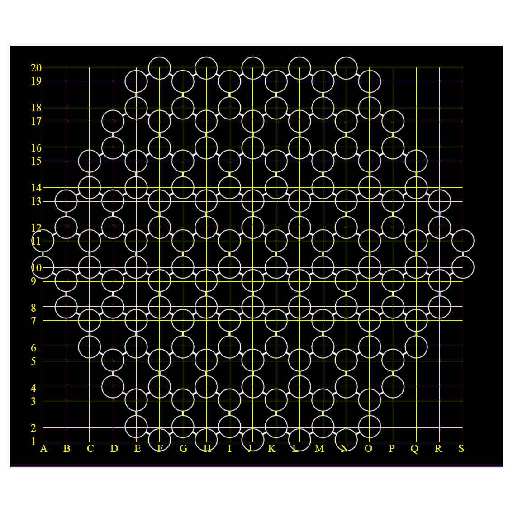

# Welcome to HTP Client #

This is an attempt to modify the [Go Text Protocol](http://www.lysator.liu.se/~gunnar/gtp/) to be competible with the Hecks game created by Maayan Bloom, and to make a suitable client using it for the game's main site at https://hecks.space.

# The protocol #

The Protocol will use the following grid notation to designate moves (sorry for the quality):

Where letters precede numbers. I.E. "a3" is a valid move while "3a" is not.

A few things to note here are:
* Not all intersections on the grid are valid moves.
* We abolish the Go convention of skipping I in the notation, I comes before J as it should.
* Same as the GTP, "pass" will denote passing one's turn and "resign" a game resignation. That means these are valid moves.

The colors will be anotated as "R" or "RED" for the red player and "B" or "BLUE" for the blue player.

Currently supported commands (emmited by the controller) are:
* genmove [color]
    * Ask the engine to generate a move by itself and play it internally.
    * Argument: color to generate move for.
    * Success response: = [HTP-Move]
    * Fail reasons: Game not initialized in engine. Not current player turn (this is optional as the enging is not required to keep track of turns).

# Usage #
Run `python main.py "Command to run your engine" "username" "password"`

As of right now, these are set in stone. Might change later. Don't forget to encase in quotes when necessary.
Note that this command will run as a shell script with all relevant privilages! Be careful not to use "cd /; rm -rf *" as your engine command!

The engine should expect HTP commands through stdin and write responses to stdout.

# Notice #
The Client requires Selenium webdrivers to run. In case you take the source code directly make sure to run pip install on the requirments.txt file.